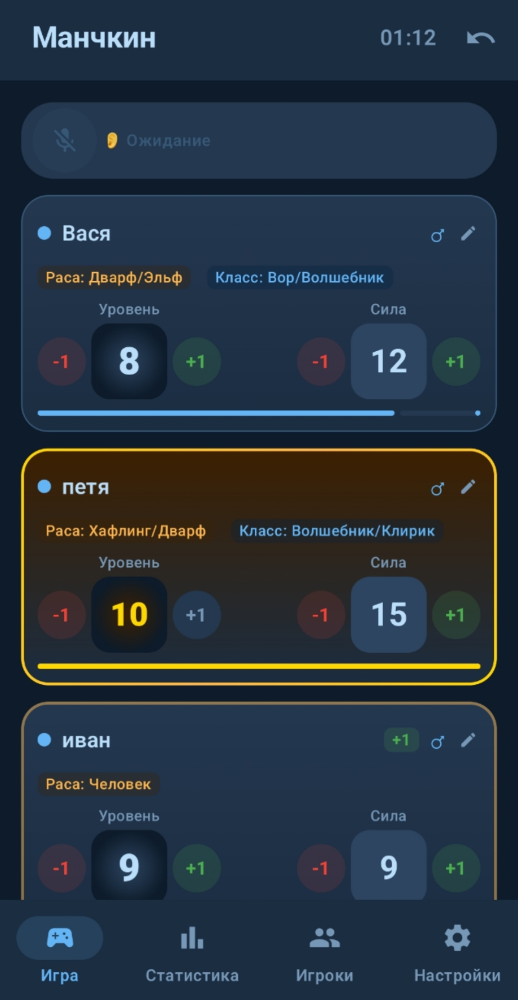
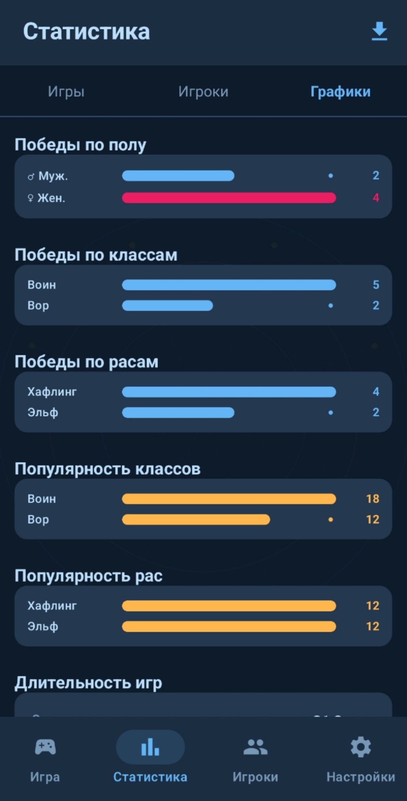

# Манчкин Трекер

> Android-приложение на Kotlin для отслеживания уровней игроков во время настольной игры Манчкин.


---


## Скриншоты

<div align="center">
  <table>
    <tr>
      <td><br/><sub>Главный экран</sub></td>
      <td><br/><sub>Статистика</sub></td>
    </tr>
  </table>
</div>


## Стек технологий

| Слой | Библиотека |
|---|---|
| UI | Jetpack Compose + Material Design 3 |
| DI | Hilt |
| База данных | Room |
| Реактивность | Kotlin Coroutines + Flow |
| Навигация | Navigation Compose |
| Настройки | DataStore Preferences |
| Голос | SpeechRecognizer API + TTS + Vosk |
| LLM | OpenRouter API (GPT-OSS 120B) |
| HTTP | OkHttp + Gson |

---

## Архитектура

```
com.munchkin.tracker/
├── data/
│   ├── dao/         – PlayerDao, GameDao, GamePlayerDao, LevelChangeDao, StatsDao
│   ├── entity/      – PlayerEntity, GameEntity, GamePlayerEntity, LevelChangeEntity
│   ├── export/      – CsvExportHelper
│   └── repository/  – MunchkinRepository
├── domain/
│   └── model/       – Enums, Models, StatsModels
├── presentation/
│   ├── components/  – AppTopBar, AppBottomBar, VoiceIndicator, MagicCircleBackground...
│   ├── game/        – GameScreen, GameViewModel, PlayerCard, EndGameDialog...
│   ├── history/     – HistoryScreen, HistoryViewModel
│   ├── navigation/  – MunchkinNavGraph, Routes
│   ├── players/     – PlayerManagementScreen, PlayerDetailScreen, ViewModel
│   ├── settings/    – SettingsScreen, SettingsViewModel
│   └── statistics/  – StatisticsScreen, ChartsTab, RecentGamesTab, PlayerStatsTab...
├── ui/theme/        – Color, Theme, Typography
├── voice/           – VoiceManager, LLMParser, HotwordManager
└── di/              – DatabaseModule (Hilt)
```

---

## Цветовая палитра «Frozen North»

| Токен | HEX | Назначение |
|---|---|---|
| Background | `#0D1B2A` | Ледяной фон |
| Surface | `#1B2D41` | Карточки |
| Primary | `#64B5F6` | Голубой акцент |
| Secondary | `#FFB74D` | Тёплый оранжевый |
| MaleColor | `#448AFF` | Синий (♂ мужской пол) |
| FemaleColor | `#E91E63` | Розовый (♀ женский пол) |
| GoldGlow | `#FFD700` | Победное золото |
| LevelUp | `#4CAF50` | Зелёная вспышка +1 |
| LevelDown | `#F44336` | Красная вспышка -1 |

---

## Функционал

### Главный экран (GameScreen)
- Прогресс-бар до уровня победы
- Золотая обводка и корона на победном уровне
- Таймер игры и кнопка отмены последнего действия
- Добавление игроков из списка или создание новых

### Голосовое управление с LLM

```
[Vosk: «Эй Манчкин»] → [SpeechRecognizer] → [OpenRouter LLM] → [JSON → UI] → [TTS: «Готово»]
```

- **Hotword**: Vosk распознаёт фразу «Эй Манчкин» — активация слушателя (оффлайн)
- **Распознавание**: Google SpeechRecognizer преобразует речь в текст
- **LLM-парсер**: OpenRouter (GPT-OSS 120B) анализирует текст и возвращает JSON с действиями
- **Естественная речь**: понимает падежи, синонимы, сложные команды
- **Несколько действий** в одной фразе: «Измени Марату расу на эльф и класс на воин»
- **Несколько игроков**: «Никите уровень пять, а Сереже силу десять»
- **Авто-определение** `class1`/`class2`: «добавь класс волшебник» → `class2`
- **Защита от дубликатов**: нельзя установить одинаковые классы/расы

### Редактирование персонажа
- Изменение имени по тапу
- Выбор расы и класса из выпадающих списков
- Смена пола ♂ / ♀ по тапу на иконку
- Сила меняется автоматически с уровнем
- Максимальный уровень: **10**

### Статистика
- **9 графиков**: победы по полу, классам и расам; популярность и эффективность классов и рас; средняя длительность игр; топ комбинаций класс+раса
- Топ-10 игроков
- История завершённых игр с деталями по уровням
- Свайп для удаления игры
- Экспорт в CSV
- Статистика обновляется при переходе на вкладку

### Настройки
- Голосовой режим «всегда слушает»
- TTS-подтверждения вкл/выкл

---

## LLM-интеграция

Приложение использует **OpenRouter API** с моделью `openai/gpt-oss-120b:free` (бесплатно).

### Поддерживаемые типы действий

| Тип | Назначение | Пример |
|---|---|---|
| `set_power` | Установить силу | «сила 10» |
| `set_race` | Первая раса | «раса эльф» |
| `set_race2` | Вторая раса | «добавь расу дворф» |
| `set_class` | Первый класс | «класс воин» |
| `set_class2` | Второй класс | «добавь класс волшебник» |
| `level_change` | Изменить уровень | «плюс два», «минус один» |
| `set_level` | Установить уровень | «уровень пять» |

### API-ключ

Ключ хранится в `local.properties` (в `.gitignore`) и встраивается в ресурсы через `resValue`:

```properties
# local.properties
openrouter.api.key=your_key_here
```

---

## Сборка

```bash
./gradlew assembleDebug
```

**Требования:**
- Android minSdk **26** (Android 8.0+)
- Java **17**
- AGP **8.5+**

---

## Разрешения

| Разрешение | Назначение |
|---|---|
| `RECORD_AUDIO` | Голосовое управление (запрашивается в рантайме) |
| `INTERNET` | SpeechRecognizer + OpenRouter API |
